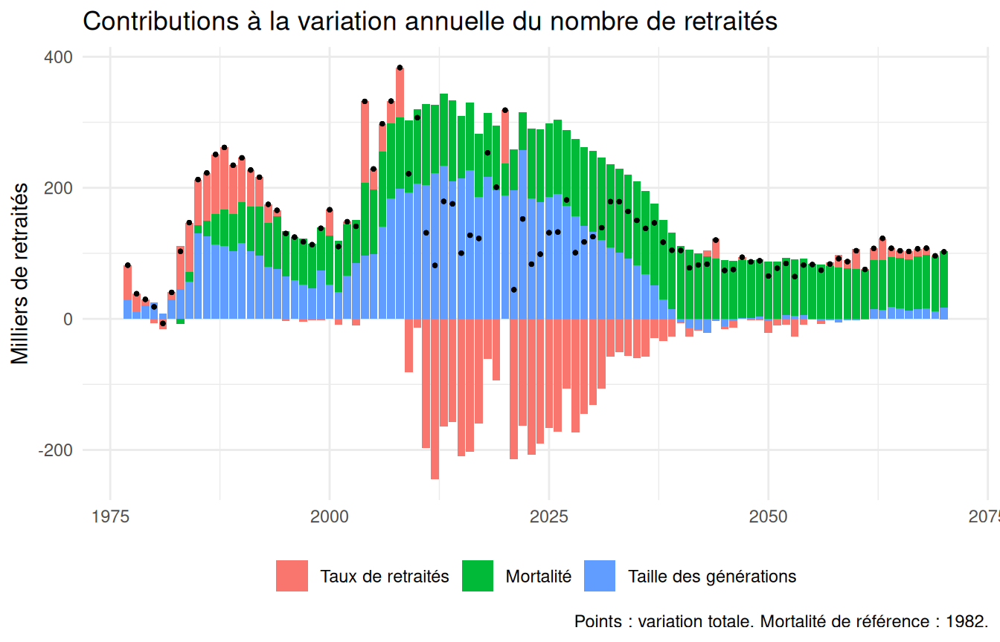
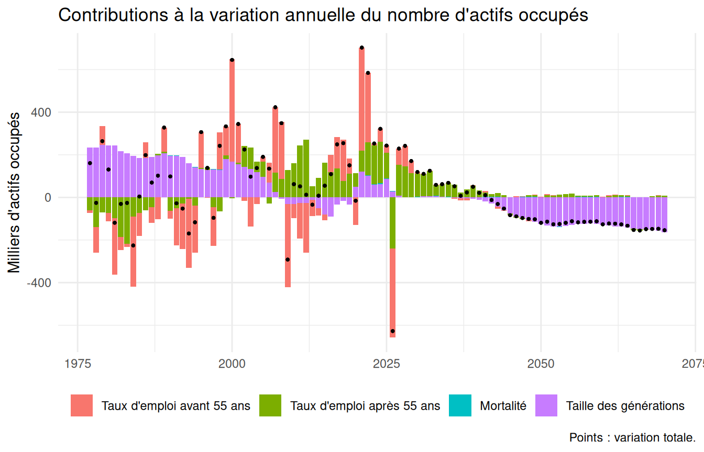
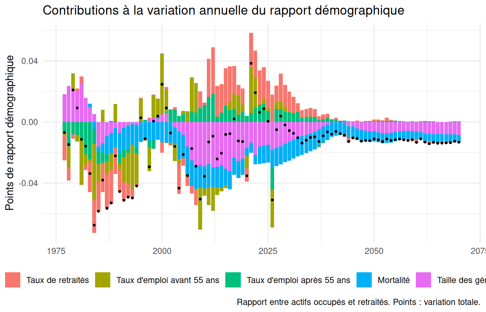
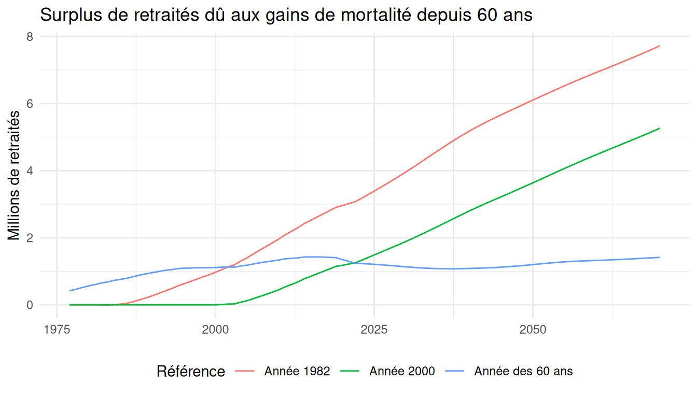

# Décomposition des évolutions démographiques

``` r

library(pilotretrtools)
library(dplyr)
library(ggplot2)

base <- construire_base()
decomposition <- decomposer_evolutions(base, reference = mortalite_annee(1982))
```

Le nombre de retraités et le rapport entre actifs occupés et retraités
évoluent sous l’effet de trois grands facteurs : la taille des
générations qui arrivent aux âges de la retraite, l’allongement de la
durée de vie, et les comportements d’activité et de départ à la
retraite, eux-mêmes largement déterminés par la réglementation. Cette
vignette décrit la décomposition calculée par
[`decomposer_evolutions()`](https://patrickaubert.github.io/pilotretrtools/reference/decomposer_evolutions.md),
puis l’illustre pour le nombre de retraités, le nombre d’actifs occupés
et le rapport démographique.

## Principe du calcul

### Un effectif, deux composantes

Le nombre de retraités (ou d’actifs occupés) une année $`t`$ est la
somme, sur les âges $`a`$ et les deux sexes, de la population au 31
décembre multipliée par un taux (de retraités, ou d’emploi) :

``` math
N(t) = \sum_a P(t,a) \, \tau(t,a)
```

D’une année sur l’autre, à chaque âge, la variation de $`P \times \tau`$
se partage exactement entre une variation du taux et une variation de la
population, chacune pondérée par la moyenne de l’autre terme sur les
deux années (notée par une barre) :

``` math
\Delta (P \tau) = \bar{P} \, \Delta \tau + \bar{\tau} \, \Delta P
```

Pondérer par des moyennes rend la décomposition indépendante de l’ordre
dans lequel on considère les effets : on n’a pas à choisir entre « taux
d’abord » et « population d’abord ».

### Mortalité et taille des générations

La population d’une génération à un âge donné dépend de sa taille à 60
ans et de sa mortalité depuis 60 ans. Pour séparer les deux, on calcule
pour chaque génération la population $`P^{ref}`$ qu’elle aurait eue si
sa mortalité à partir de 60 ans était restée celle d’une référence (par
défaut, la mortalité de l’année 1982). L’écart $`G = P - P^{ref}`$ est
le surplus de population dû aux gains de mortalité depuis la référence.
La variation de la population se décompose alors en :

``` math
\Delta P = \Delta G + \Delta P^{ref}
```

d’où la décomposition complète de la variation annuelle :

``` math
\Delta N = \sum_a \bar{P}(a) \, \Delta \tau(a) + \sum_a \bar{\tau}(a) \, \Delta G(a) + \sum_a \bar{\tau}(a) \, \Delta P^{ref}(a)
```

soit un **effet des taux**, un **effet de la mortalité** et un **effet
de la taille des générations**. Ce dernier recouvre tous les
déterminants de la taille des générations à 60 ans : nombre de
naissances, migrations, mortalité avant 60 ans. Il inclut aussi les
migrations après 60 ans.

En pratique, le surplus $`G`$ est mesuré comme l’écart entre deux
projections de la génération menées de la même façon à partir de 60 ans,
l’une avec les quotients de mortalité effectifs, l’autre avec ceux de la
référence
([`projeter_mortalite_reference()`](https://patrickaubert.github.io/pilotretrtools/reference/projeter_mortalite_reference.md)).
Comparer directement la population observée à la projection de référence
mêlerait aux gains de mortalité l’écart entre les décès observés et ceux
que donne la formule à partir des quotients.

### Le choix de la référence de mortalité

Mesurer l’effet de la mortalité par rapport à une référence fixe, plutôt
que par rapport à la génération précédente, a deux conséquences :

- les effets annuels s’additionnent dans le temps : leur somme sur une
  période est égale à la variation, sur cette période, du surplus de
  retraités dû aux gains de mortalité. Avec la génération précédente
  comme référence, chaque année « oublierait » les gains acquis
  auparavant ;
- l’effet de la mortalité inclut l’application des gains cumulés depuis
  la référence à des générations de tailles différentes, et l’effet de
  la taille des générations est mesuré avec la mortalité de référence.
  Cette lecture est cohérente avec une logique de partage des gains
  d’espérance de vie par rapport à une situation de référence.

La contrepartie est que l’effet de la mortalité dépend de la référence
et croît mécaniquement à mesure qu’on s’en éloigne. Trois références
sont proposées :

| Fonction | Mortalité de référence |
|----|----|
| `mortalite_annee(1982)` | quotients d’une année donnée, appliqués après cette année |
| `mortalite_generation(1950)` | quotients d’une génération donnée, appliqués à toutes |
| `mortalite_annee_age(60)` | pour chaque génération, quotients de l’année de ses 60 ans |

L’âge à partir duquel la mortalité de référence s’applique (60 ans par
défaut) est paramétrable (`age_debut_mortalite`).

### Le rapport démographique

La variation du rapport démographique $`R = E / N`$ (actifs occupés
$`E`$ sur retraités $`N`$) est décomposée de façon exacte par la méthode
des moyennes logarithmiques (LMDI). La contribution d’un effet $`k`$
s’écrit :

``` math
\Delta R_k = L(R) \times \left[ \Delta E_k / L(E) - \Delta N_k / L(N) \right]
```

où $`\Delta E_k`$ et $`\Delta N_k`$ sont les effets sur les actifs
occupés et sur les retraités, et $`L`$ la moyenne logarithmique des
valeurs des deux années :

``` math
L(x, y) = (x - y) / (\ln x - \ln y)
```

Les contributions s’additionnent exactement à la variation du rapport.
Les effets des taux sont distingués selon qu’ils portent sur les
retraités ou sur l’emploi, et pour l’emploi avant et après 55 ans
(`age_seuil_emploi`), pour isoler l’effet des réformes des retraites sur
l’emploi des seniors.

### Précautions

- La population doit être corrigée des ruptures de champ géographique
  ([`corriger_champ()`](https://patrickaubert.github.io/pilotretrtools/reference/corriger_champ.md),
  fait par défaut par
  [`construire_base()`](https://patrickaubert.github.io/pilotretrtools/reference/construire_base.md))
  : sans cela, l’ajout des DROM en 1995 et de Mayotte en 2014
  apparaîtrait comme un effet de la taille des générations.
- Le passage des taux d’emploi observés aux taux projetés par le COR,
  entre 2025 et 2026, crée un saut de niveau qui apparaît comme un effet
  des taux d’emploi cette année-là (voir
  [`vignette("ecarts-insee")`](https://patrickaubert.github.io/pilotretrtools/articles/ecarts-insee.md)).

## Le nombre de retraités

``` r

donnees_graph_decomposition(decomposition, "retraites", annees = 1977:2070) |>
  ggplot(aes(annee, valeur / 1000)) +
  geom_col(aes(fill = effet)) +
  geom_point(aes(y = variation / 1000), size = 0.6) +
  labs(x = NULL, y = "Milliers de retraités", fill = NULL,
       title = "Contributions à la variation annuelle du nombre de retraités",
       caption = "Points : variation totale. Mortalité de référence : 1982.") +
  theme_minimal() +
  theme(legend.position = "bottom")
```



L’arrivée à 60 ans des générations nombreuses du baby-boom, à partir de
2006, porte l’effet de la taille des générations. Les réformes des
retraites, qui réduisent les taux de retraités aux âges proches de l’âge
d’ouverture des droits, se traduisent par des effets des taux négatifs.
L’effet de la mortalité, positif, s’accroît à mesure que les gains de
mortalité depuis 1982 s’accumulent, et devient le principal moteur de la
hausse du nombre de retraités à long terme.

Sur une période, les effets s’additionnent :

``` r

periode <- function(debut, fin) {
  decomposition |>
    filter(annee > debut, annee <= fin) |>
    summarise(periode = paste(debut, fin, sep = "-"),
              variation = sum(d_nb_retraites),
              taux = sum(d_nb_retraites_taux),
              mortalite = sum(d_nb_retraites_mortalite),
              taille = sum(d_nb_retraites_taille))
}
bind_rows(periode(1980, 2000), periode(2000, 2025), periode(2025, 2050),
          periode(2050, 2070)) |>
  mutate(across(-periode, ~ round(.x / 1e6, 2)))
#> # A tibble: 4 × 5
#>   periode   variation  taux mortalite taille
#>   <chr>         <dbl> <dbl>     <dbl>  <dbl>
#> 1 1980-2000      3.29  0.77      0.97   1.54
#> 2 2000-2025      4.7  -2.15      2.45   4.41
#> 3 2025-2050      2.93 -1.22      2.75   1.39
#> 4 2050-2070      1.87  0.12      1.61   0.14
```

(en millions de retraités)

## Le nombre d’actifs occupés

``` r

donnees_graph_decomposition(decomposition, "actifs_occupes",
                            annees = 1977:2070) |>
  ggplot(aes(annee, valeur / 1000)) +
  geom_col(aes(fill = effet)) +
  geom_point(aes(y = variation / 1000), size = 0.6) +
  labs(x = NULL, y = "Milliers d'actifs occupés", fill = NULL,
       title = "Contributions à la variation annuelle du nombre d'actifs occupés",
       caption = "Points : variation totale.") +
  theme_minimal() +
  theme(legend.position = "bottom")
```



L’effet de la mortalité est ici faible, puisqu’il ne porte que sur les
actifs occupés de 60 ans et plus. L’effet des taux d’emploi après 55 ans
traduit notamment le recul des âges de départ à la retraite.

## Le rapport démographique

``` r

donnees_graph_decomposition(decomposition, "rapport_demo",
                            annees = 1977:2070) |>
  ggplot(aes(annee, valeur)) +
  geom_col(aes(fill = effet)) +
  geom_point(aes(y = variation), size = 0.6) +
  labs(x = NULL, y = "Points de rapport démographique", fill = NULL,
       title = "Contributions à la variation annuelle du rapport démographique",
       caption = "Rapport entre actifs occupés et retraités. Points : variation totale.") +
  theme_minimal() +
  theme(legend.position = "bottom")
```



## Sensibilité à la référence de mortalité

Le surplus de retraités dû aux gains de mortalité dépend de la référence
retenue :

``` r

surplus <- function(reference, libelle) {
  decomposer_evolutions(base, reference = reference) |>
    transmute(annee, surplus = nb_retraites - nb_retraites_ref,
              reference = libelle)
}
bind_rows(
  surplus(mortalite_annee(1982), "Année 1982"),
  surplus(mortalite_annee(2000), "Année 2000"),
  surplus(mortalite_annee_age(60), "Année des 60 ans")
) |>
  filter(annee >= 1977, annee <= 2070) |>
  ggplot(aes(annee, surplus / 1e6, colour = reference)) +
  geom_line() +
  labs(x = NULL, y = "Millions de retraités", colour = "Référence",
       title = "Surplus de retraités dû aux gains de mortalité depuis 60 ans") +
  theme_minimal() +
  theme(legend.position = "bottom")
```



Avec une année de référence, le surplus est nul jusqu’à cette année puis
croît. Avec la mortalité de l’année des 60 ans, la référence est propre
à chaque génération : le surplus ne mesure que les gains intervenus
depuis que chaque génération a atteint 60 ans. Les quotients de
mortalité n’étant disponibles qu’à partir de 1962, l’année de référence
des générations nées avant 1902 est ramenée à 1962 : pour elles, seuls
les gains intervenus depuis 1962 sont mesurés.
