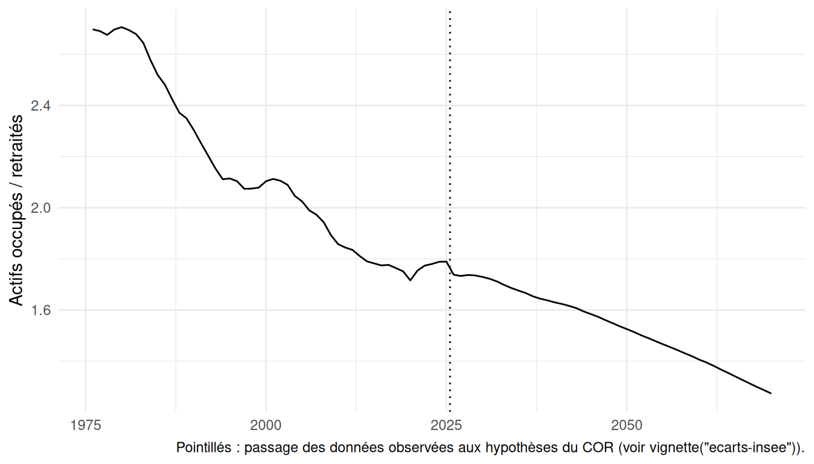
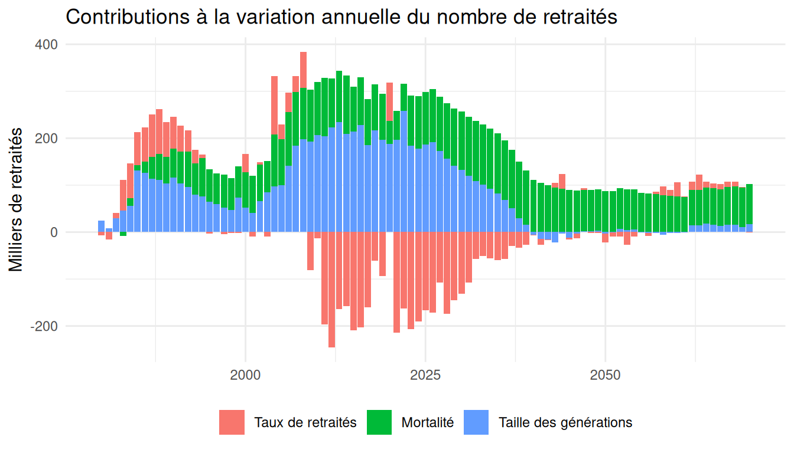

# Prise en main

``` r

library(pilotretrtools)
library(dplyr)
library(ggplot2)
```

Cette vignette montre comment obtenir la base démographique du package
(population, retraités, actifs et actifs occupés par sexe, année et
âge), d’abord en une ligne, puis étape par étape, et comment construire
des variantes. Elle se termine par quelques exploitations simples.

## La base complète en une ligne

``` r

base <- construire_base()
```

Avec les valeurs par défaut,
[`construire_base()`](https://patrickaubert.github.io/pilotretrtools/reference/construire_base.md)
utilise les tables du scénario central embarquées dans le package et
fonctionne hors ligne :

- population : scénario central des projections de l’Insee (millésime
  2026), prolongé jusqu’en 2180 avec les quotients de mortalité de 2125
  reconduits, précédé de la série historique depuis 1901 ;
- effectifs corrigés des ruptures de champ géographique (France entière)
  ;
- taux de retraités du COR (rapport de 2025), complétés avant 2000 par
  les taux rétrospectifs construits à partir des EIR ;
- taux d’activité et d’emploi de l’enquête Emploi, puis du COR avec une
  hypothèse de chômage de long terme de 7 %, lissés par âge fin.

La base compte une ligne par sexe, année et âge (de 0 à 120 ans) :

``` r

base |>
  filter(sexe == "F", annee == 2030, age3112 %in% 60:64) |>
  select(sexe, generation, annee, age3112, population3112,
         tx_retraites, nb_retraites, tx_emploi, nb_actifs_occupes)
#> # A tibble: 5 × 9
#>   sexe  generation annee age3112 population3112 tx_retraites nb_retraites
#>   <chr>      <dbl> <dbl>   <dbl>          <dbl>        <dbl>        <dbl>
#> 1 F           1970  2030      60         455021       0.0297       13510.
#> 2 F           1969  2030      61         446238       0.0245       10922.
#> 3 F           1968  2030      62         441670       0.241       106624.
#> 4 F           1967  2030      63         438832       0.330       144769.
#> 5 F           1966  2030      64         447341       0.625       279707.
#> # ℹ 2 more variables: tx_emploi <dbl>, nb_actifs_occupes <dbl>
```

Les principales colonnes sont :

| Colonne | Contenu |
|----|----|
| `generation`, `annee`, `age3112` | génération, année, âge atteint dans l’année |
| `population`, `population3112` | population au 1er janvier, au 31 décembre |
| `deces`, `qx`, `solde_migratoire`, `naissances` | composantes démographiques |
| `tx_retraites`, `nb_retraites` | taux et nombre de retraités au 31 décembre |
| `tx_nouveaux_retraites`, `nb_nouveaux_retraites` | nouveaux retraités de l’année |
| `tx_activite`, `tx_emploi`, `tx_chomage` | taux d’activité, d’emploi, de chômage |
| `nb_actifs`, `nb_actifs_occupes` | actifs et actifs occupés au 31 décembre |
| `prolonge`, `champ` | valeurs calculées par le package, champ géographique |

Les séries historiques antérieures à 1946 sont lacunaires (années de
guerre, champ variable) : pour la plupart des usages, il est préférable
de filtrer les années à partir de 1946. Les écarts avec les données
publiées sont détaillés dans
[`vignette("ecarts-insee")`](https://patrickaubert.github.io/pilotretrtools/articles/ecarts-insee.md).

## Ce que fait `construire_base()`, étape par étape

Le code suivant reproduit les étapes de
[`construire_base()`](https://patrickaubert.github.io/pilotretrtools/reference/construire_base.md)
à partir des fichiers de l’Insee et du COR. Il nécessite un accès à
internet ; les fichiers téléchargés sont conservés en cache
([`vider_cache()`](https://patrickaubert.github.io/pilotretrtools/reference/vider_cache.md)
pour les supprimer).

``` r

# 1. Population : lecture du scénario de l'Insee et de l'hypothèse de
#    mortalité prolongée jusqu'en 2125
projpop_insee <- lire_projpop_insee(
  url = url_source("projpop", scenario = "central"),
  url_mortalite = url_source("projmort"),
  hyp_mortalite = "central"
)

# 2. Coefficients de correction des ruptures de champ (1995 : DROM,
#    2014 : Mayotte), à partir des populations publiées dans les deux champs
coef_champ <- calculer_coef_champ(lire_pop_champs_insee())

# 3. Prolongation jusqu'en 2180 et reconstitution des grands âges, puis
#    ajout de la série historique 1901-1961
population <- prolonger_projpop(projpop_insee, horizon = 2180,
                                prolongation_mortalite = "constante",
                                coef_champ = coef_champ) |>
  ajouter_serie_historique()

# 4. Correction des ruptures de champ (à faire avant d'ajouter les
#    retraités et les actifs)
population <- corriger_champ(population)

# 5. Taux de retraités : COR, complétés par les taux rétrospectifs EIR
taux_retraites <- construire_taux_retraites(lire_taux_retraites_cor())

# 6. Taux d'activité et d'emploi : enquête Emploi, PPA et hypothèses du COR
#    (chômage de long terme de 7 %), lissés par âge fin
taux_activite <- construire_taux_activite(
  lire_taux_emploi_eec(),
  lire_taux_activite_ppa(),
  lire_hypotheses_cor(chomage = 7),
  population = population
)

# 7. Assemblage
base <- population |>
  ajouter_retraites(taux_retraites) |>
  ajouter_actifs(taux_activite)
```

Chaque étape peut être remplacée : par exemple, des taux de retraités
issus d’une autre source peuvent être passés à
[`ajouter_retraites()`](https://patrickaubert.github.io/pilotretrtools/reference/ajouter_retraites.md),
à condition de respecter le format attendu (colonnes `sexe`, `annee`,
`age3112`, `tx_retraites`).

Les tables intermédiaires du scénario central sont embarquées dans le
package : `projpop_central` (population, non corrigée des ruptures de
champ), `taux_retraites_central` et `taux_activite_central` (taux lissés
par âge fin). Les taux d’activité, d’emploi et de chômage tels que
publiés par l’Insee et le COR, par tranche d’âge et sans lissage, sont
dans `taux_activite_publies`.

## Construire des variantes

Les variantes sont construites à partir des fichiers de l’Insee et du
COR (accès à internet nécessaire).

**Autre hypothèse de chômage du COR** (5 %, 7 % ou 10 %) : seuls les
taux d’activité et d’emploi sont recalculés.

``` r

base_chomage_10 <- construire_base(chomage = 10)
```

**Autre scénario des projections de l’Insee** : passer l’adresse du
fichier du scénario (même format que le scénario central) et l’hypothèse
de mortalité correspondante. Les adresses utilisées sont regroupées dans
[`sources_donnees()`](https://patrickaubert.github.io/pilotretrtools/reference/sources_donnees.md)
; un scénario peut y être ajouté pour être retrouvé avec
[`url_source()`](https://patrickaubert.github.io/pilotretrtools/reference/url_source.md).

``` r

base_variante <- construire_base(
  url_scenario = "https://www.insee.fr/fr/statistiques/fichier/.../xx_scenario.xlsx",
  hyp_mortalite = "haute"
)
```

**Mortalité au-delà de 2125** : prolonger la tendance des quotients
plutôt que de les reconduire.

``` r

base_tendance <- construire_base(prolongation_mortalite = "tendance")
```

**Sans correction de champ, sans série historique** :

``` r

base_publiee <- construire_base(corriger_champ = FALSE,
                                serie_historique = FALSE)
```

## Quelques exploitations

### Séries annuelles

``` r

series <- base |>
  filter(annee >= 1976, annee <= 2070) |>
  summarise(population = sum(population3112),
            retraites = sum(nb_retraites),
            actifs_occupes = sum(nb_actifs_occupes),
            .by = annee) |>
  mutate(rapport_demo = actifs_occupes / retraites)

series |> filter(annee %in% c(1980, 2000, 2025, 2050, 2070))
#> # A tibble: 5 × 5
#>   annee population retraites actifs_occupes rapport_demo
#>   <dbl>      <dbl>     <dbl>          <dbl>        <dbl>
#> 1  1980  55365625.  8807125.      23833603.         2.71
#> 2  2000  61071972. 12093051.      25436147.         2.10
#> 3  2025  69081979  16797452.      30053207.         1.79
#> 4  2050  68985628  19725086.      30088444.         1.53
#> 5  2070  65694041  21591371.      27495549.         1.27
```

``` r

ggplot(series, aes(annee, rapport_demo)) +
  geom_line() +
  geom_vline(xintercept = 2025.5, linetype = "dotted") +
  labs(x = NULL, y = "Actifs occupés / retraités",
       caption = paste("Pointillés : passage des données observées aux",
                       "hypothèses du COR (voir vignette(\"ecarts-insee\")).")) +
  theme_minimal()
```



### Décomposition des évolutions

[`decomposer_evolutions()`](https://patrickaubert.github.io/pilotretrtools/reference/decomposer_evolutions.md)
décompose chaque année la variation du nombre de retraités, du nombre
d’actifs occupés et du rapport démographique en effets des taux, de la
mortalité (par rapport à la mortalité de 1982, à partir de 60 ans) et de
la taille des générations.

``` r

decomposition <- decomposer_evolutions(base, reference = mortalite_annee(1982))

decomposition |>
  filter(annee %in% c(1990, 2005, 2010, 2025, 2040, 2060)) |>
  select(annee, d_nb_retraites, d_nb_retraites_taux,
         d_nb_retraites_mortalite, d_nb_retraites_taille)
#> # A tibble: 6 × 5
#>   annee d_nb_retraites d_nb_retraites_taux d_nb_retraites_mortalite
#>   <dbl>          <dbl>               <dbl>                    <dbl>
#> 1  1990        245762.              67458.                   62675.
#> 2  2005        228808.              30874.                   98643.
#> 3  2010        307052.             -13094.                  113127.
#> 4  2025        131481.            -166453.                  111375.
#> 5  2040        104410.              -1122.                  110939.
#> 6  2060        104025.              30723.                   75648.
#> # ℹ 1 more variable: d_nb_retraites_taille <dbl>
```

``` r

donnees_graph_decomposition(decomposition, "retraites", annees = 1980:2070) |>
  ggplot(aes(annee, valeur / 1000, fill = effet)) +
  geom_col() +
  labs(x = NULL, y = "Milliers de retraités", fill = NULL,
       title = "Contributions à la variation annuelle du nombre de retraités") +
  theme_minimal() +
  theme(legend.position = "bottom")
```



La référence de mortalité se change avec
[`mortalite_annee()`](https://patrickaubert.github.io/pilotretrtools/reference/reference_mortalite.md),
[`mortalite_generation()`](https://patrickaubert.github.io/pilotretrtools/reference/reference_mortalite.md)
ou
[`mortalite_annee_age()`](https://patrickaubert.github.io/pilotretrtools/reference/reference_mortalite.md)
(voir
[`?reference_mortalite`](https://patrickaubert.github.io/pilotretrtools/reference/reference_mortalite.md)).
Le principe du calcul, les formules et les décompositions des actifs
occupés et du rapport démographique sont présentés dans
[`vignette("decomposition")`](https://patrickaubert.github.io/pilotretrtools/articles/decomposition.md).

## Pour aller plus loin

- [`vignette("conventions")`](https://patrickaubert.github.io/pilotretrtools/articles/conventions.md)
  : conventions de la grille génération × âge × année et organisation du
  package ;
- [`vignette("decomposition")`](https://patrickaubert.github.io/pilotretrtools/articles/decomposition.md)
  : principe et illustrations de la décomposition des évolutions
  démographiques ;
- [`vignette("ecarts-insee")`](https://patrickaubert.github.io/pilotretrtools/articles/ecarts-insee.md)
  : écarts avec les données publiées par l’Insee et le COR, et
  hypothèses de construction.
